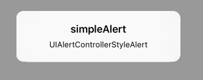
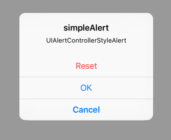
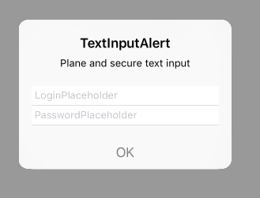
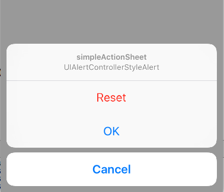

# UIAlertController for iOS8

## SimpleAlertController

### Image



### Usage
Insert the following into the viewDidLoad of your view controller or wherever else you see fit.


```objective-c
UIAlertController *alertController = [UIAlertController
alertControllerWithTitle:@"simpleAlert"
message:@"UIAlertControllerStyleAlert"
preferredStyle:UIAlertControllerStyleAlert];


[self presentViewController:alertController animated:YES completion:nil];
```

## ButtonAlertController

### Image



### Usage
Insert the following into the viewDidLoad of your view controller or wherever else you see fit.


```objective-c
UIAlertController *alertController = [UIAlertController
alertControllerWithTitle:@"simpleAlert"
message:@"UIAlertControllerStyleAlert"
preferredStyle:UIAlertControllerStyleAlert];


UIAlertAction *cancelAction = [UIAlertAction
actionWithTitle:@"Cancel"
style:UIAlertActionStyleCancel
handler:^(UIAlertAction *action)
{
NSLog(@"Cancel action");
}];


UIAlertAction *okAction = [UIAlertAction
actionWithTitle:@"OK"
style:UIAlertActionStyleDefault
handler:^(UIAlertAction *action)
{
NSLog(@"OK action");
}];

UIAlertAction *resetAction = [UIAlertAction
actionWithTitle:@"Reset"
style:UIAlertActionStyleDestructive
handler:^(UIAlertAction *action)
{
NSLog(@"Reset action");
}];
[alertController addAction:resetAction];
[alertController addAction:cancelAction];
[alertController addAction:okAction];

[self presentViewController:alertController animated:YES completion:nil];
```


## TextInputAlertController

### Image



### Usage
Insert the following into the viewDidLoad of your view controller or wherever else you see fit.


```objective-c
-(IBAction)textFieldAlert:(id)sender{

UIAlertController *alertController = [UIAlertController
alertControllerWithTitle:@"TextInputAlert"
message:@"Plane and secure text input"
preferredStyle:UIAlertControllerStyleAlert];

[alertController addTextFieldWithConfigurationHandler:^(UITextField *textField)
{
[textField addTarget:self
action:@selector(alertTextFieldDidChange:)
forControlEvents:UIControlEventEditingChanged];
textField.placeholder = @"LoginPlaceholder
}];

[alertController addTextFieldWithConfigurationHandler:^(UITextField *textField)
{
textField.placeholder =@"PasswordPlaceholder"
textField.secureTextEntry = YES;
}];

UIAlertAction *okAction = [UIAlertAction
actionWithTitle:@"OK"
style:UIAlertActionStyleDefault
handler:^(UIAlertAction *action)
{
UITextField *login = alertController.textFie cds.firstObject;
UITextField *password = alertController.textFields.lastObject;
NSLog(@"login = %@", login.text);
NSLog(@"password = %@", password.text);
}];

okAction.enabled = NO;
[alertController addAction:okAction];
[self presentViewController:alertController animated:YES completion:nil];
}

- (void)alertTextFieldDidChange:(UITextField *)sender
{
UIAlertController *alertController = (UIAlertController *)self.presentedViewController;
if (alertController)
{
UITextField *login = alertController.textFields.firstObject;
UIAlertAction *okAction = alertController.actions.lastObject;
okAction.enabled = login.text.length > 2;
}
}
```


## ActionSheetController

### Image



### Usage
Insert the following into the viewDidLoad of your view controller or wherever else you see fit.


```objective-c
UIAlertController *alertController = [UIAlertController
alertControllerWithTitle:@"simpleAlert"
message:@"UIAlertControllerStyleAlert"
preferredStyle:UIAlertControllerStyleActionSheet];


UIAlertAction *cancelAction = [UIAlertAction
actionWithTitle:@"Cancel"
style:UIAlertActionStyleCancel
handler:^(UIAlertAction *action)
{
NSLog(@"Cancel action");
}];

UIAlertAction *okAction = [UIAlertAction
actionWithTitle:@"OK"
style:UIAlertActionStyleDefault
handler:^(UIAlertAction *action)
{
NSLog(@"OK action");
}];

UIAlertAction *resetAction = [UIAlertAction
actionWithTitle:@"Reset"
style:UIAlertActionStyleDestructive
handler:^(UIAlertAction *action)
{
NSLog(@"Reset action");
}];
[alertController addAction:resetAction];
[alertController addAction:cancelAction];
[alertController addAction:okAction];

[self presentViewController:alertController animated:YES completion:nil];

```

